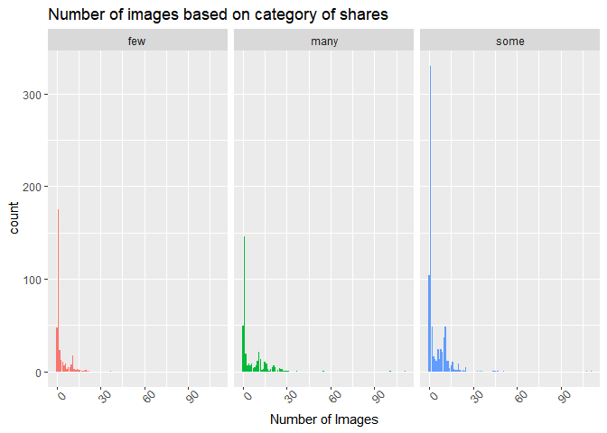
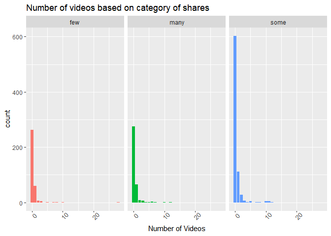
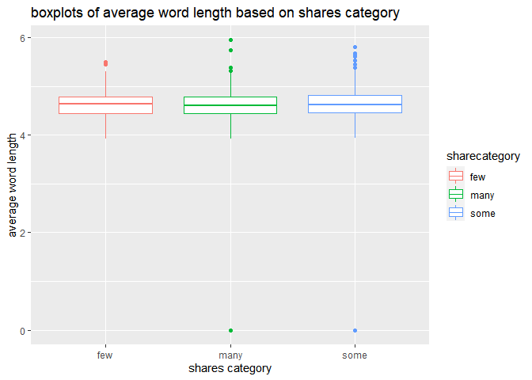
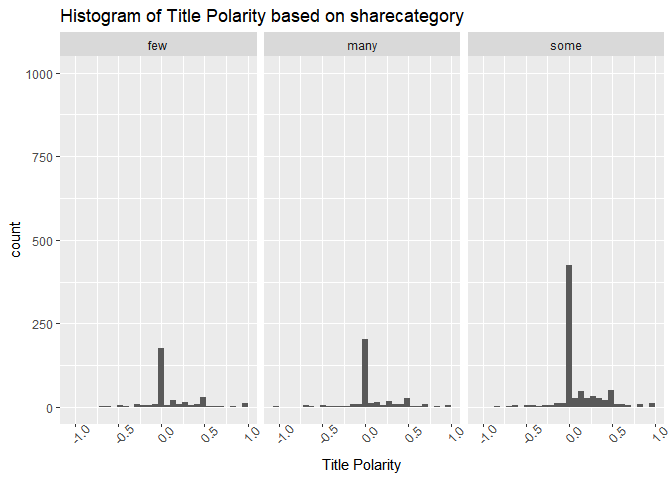

Lifestyle Analysis
================
Brennan Clinch & Allison Warhus
10/29/2021

-   [Introduction](#introduction)
-   [Import and Subset data](#import-and-subset-data)
-   [Exploratory Data Analysis (EDA)](#exploratory-data-analysis-eda)
-   [Model fitting](#model-fitting)
    -   [Linear Models](#linear-models)
        -   [Model 1: (OLS)](#model-1-ols)
        -   [Model 2: Poisson Regression model (GLM)](#model-2-poisson-regression-model-glm)
-   [Ensemble Methods](#ensemble-methods)
    -   [Boosted Tree Model](#boosted-tree-model)
    -   [Random Forest](#random-forest)      
-   [Model Comparison](#model-comparison)

# Introduction

We are going to analyze the Online News Popularity dataset. It is a
dataset which is used to predict the number of shares and article
published on Mashable.com got on social media sites.We are going to use
the following variables to predict Number of Shares. We are going to
analyze the Online News Popularity dataset. It is a dataset which is
used to predict the number of shares and article published on
Mashable.com got on social media sites. We are going to use the following
variables to predict Number of Shares.

\*num\_imgs: Number of images

\*num\_videos: Number of videos

\*average\_token\_length: Average length of the words in the content

and

\*title\_sentiment\_polarity: Title polarity

To predict the Number of Shares, we will use linear regression and
ensemble based tree methods, including random forest and boosted trees.

# Import and Subset data

``` r
library(tidyverse)
library(caret)
## Read in Raw Data Using Relative Path
Data <- read_csv("OnlineNewsPopularity.csv") 
## Create a New Variable to Data Channel to use when automating.
automationdata <- Data %>% mutate(data_channel =   if_else(data_channel_is_lifestyle == 1, "Lifestyle Analysis",
       if_else(data_channel_is_entertainment == 1, "Entertainment Analysis",
               if_else(data_channel_is_bus == 1, "Business Analysis",
                      if_else(data_channel_is_socmed == 1, "Social Media Analysis",
                              if_else(data_channel_is_tech == 1, "Tech Analysis", "World Analysis"))))))
## Subset Data for Respective Data Channel
subsetted_data <- automationdata %>% filter(data_channel == params$data_channel)
```
Let's now split up our subsetted data sets to training and testing (70/30)

``` r
## Create Training and Test Data Sets
set.seed(50)
trainIndex <- createDataPartition(subsetted_data$shares, p = 0.7, list = FALSE)
trainData <- subsetted_data[trainIndex,]
testData <- subsetted_data[-trainIndex,]
trainData
```

## Exploratory Data Analysis (EDA)
Now that we have our data split up, we are ready to do exploratory data analysis on all the variables we will be using in our predictive models.

Let us first take a look at shares. We created a new variable sharesSumm that provides a 5-number summary of shares for the Lifestyle channel.
``` r
sharesSumm<-trainData %>% 
  summarize("Min"=min(shares),
            "1st Quartile"=quantile(shares,0.25),
            "Median"=quantile(shares,0.5),
            "3rd Quartile"=quantile(shares,0.75),
            "Max"=max(shares)
            )
knitr ::kable(sharesSumm, caption = "5-number summary for number of shares")
```

| Min | 1st Quartile | Median | 3rd Quartile |    Max |
|----:|-------------:|-------:|-------------:|-------:|
|  78 |         1100 |   1700 |         3225 | 208300 |

5-number summary for number of shares

Based on the 5-number summary, it does appear our data might be skewed since the Max is way off from the Min, Q1,Median, and Q3. So our median tells us a better estimate on our average number of shares here.

Let’s create a new factor variable for the training set which categorizes shares based on the number of them.

After creating the new variable, let’s create a contingency table for it.

``` r
trainData<- trainData %>% 
  mutate(sharecategory = ifelse(shares <quantile(shares,0.25), "few",
                      ifelse(shares %in% quantile(shares,0.25):quantile(shares,0.75), "some",
                             "many")))
testData <- testData %>% mutate(sharecategory = ifelse(shares <quantile(shares,0.25), "few",ifelse(shares %in% quantile(shares,0.25):quantile(shares,0.75), "some",
                             "many")))
knitr::kable(table(trainData$sharecategory), caption = paste0("contingency table for sharecategory"))
```


| Var1 | Freq |
|:-----|-----:|
| few  |  338 |
| many |  368 |
| some |  766 |

contingency table for sharecategory

From the table, it appears that for the Lifestyle channel, most shares were between the first and third quartile and the least were less than the first quartile.

Let’s now create bar plots of the number of images and the number of videos based on the new variable which is the category of shares based on the number of them.

``` r
g<-ggplot(data=trainData,aes(x=num_imgs,fill=sharecategory))
g+geom_bar(position="dodge")+
  labs(x="Number of Images", title = "Number of images based on category of shares")+
  theme(legend.title=element_blank(),
        axis.text.x=element_text(angle=45))+
  facet_wrap(~sharecategory)+
  theme(legend.position = "None")
```

<!-- -->

Looking at the plots, it appears our data is extremely skewed with most of the number of images being equal to zero especially when share category was equal to 'some', so while most images were not a lot and were mostly zero, the more average the shares the fewer the number of images for each article in the Lifestyle channel.

``` r
g<-ggplot(data=trainData,aes(x=num_videos, fill=sharecategory))
g+geom_bar(position="dodge")+
  labs(x="Number of Videos", title = "Number of videos based on category of shares")+
  theme(legend.title=element_blank(),
        axis.text.x=element_text(angle=45))+
  facet_wrap(~sharecategory)+
  theme(legend.position = "None")
```

<!-- -->

Looking at the plots, it appears our data is extremely skewed with most of the number of videos being equal to zero especially when share category was equal to 'some', so while most videos were not a lot and were mostly zero, the more average the shares the fewer the number of videos for each article in the Lifestyle channel.

We can inspect the trend of number of images and videos and how it
affects number of shares. If the tallest and most concentrated chunk of
bars is in a different spot for each share category, then we can
conclude that the number of images videos (depending on the graph you
are looking at) is related to the number of shares. If each of the three
graphs looks the same, then we would conclude that images and videos do
not necessarily impact the number of shares.

We will hypothesize that the shorter the average word length, the more popular
a media item will be. So we will analyze word length next. First, let’s
get the mean and standard deviation of word length in all of the media
items. Next, we can look at how word length differs based on share
category.

``` r
wordSumm<-trainData %>% 
  summarize("Mean"=mean(average_token_length),
            "Standard Deviation"=sd(average_token_length))
knitr ::kable(wordSumm, caption = "Mean and Standard deviation of average word length")
```

|     Mean | Standard Deviation |
|---------:|-------------------:|
| 4.588392 |          0.5650087 |

Mean and Standard deviation of average word length

From the summary, it appears the mean of average word length for the Lifestyle channel was 4.59 and the standard deviation was 0.57.

Next we will look at the same summary statistics but now they are based on each share category.

``` r
wordSumm2<-trainData %>% group_by(sharecategory) %>%
  summarize("Mean"=mean(average_token_length),
            "Standard Deviation"=sd(average_token_length))
knitr ::kable(wordSumm2, caption = "Mean and Standard deviation of average word length by share category")
```

| sharecategory |     Mean | Standard Deviation |
|:--------------|---------:|-------------------:|
| few           | 4.628291 |          0.2705660 |
| many          | 4.506519 |          0.8027016 |
| some          | 4.610118 |          0.5177738 |

Mean and Standard deviation of average word length by share category

Looking at the summary statistics, the share category that got the lowest mean was 'many', the highest mean was 'few', the lowest standard deviation was 'few', and the highest standard deviation was 'many'. 

This can better be summarized with the boxplots below

``` r
g1 <- ggplot(data = trainData, aes(x=sharecategory, y = average_token_length, color = sharecategory))
g1+geom_boxplot()+
  labs(title = "boxplots of average word length based on shares category", x = "shares category", y = "average word length")
```

<!-- -->

From the boxplots, it does appear that each boxplot is a little bit symmetrical in distribution by looking at the box part with q1, median, and q3, but it does appear that it may be a bit skewed since we have many outlying values. We can also clearly see that `few` had the biggest average word length and 'many' had the highest maximum.

Finally, we’ll explore the title polarity vs. the share category using a histogram.

``` r
g<-ggplot(data=trainData,aes(title_sentiment_polarity,color=title_sentiment_polarity))
g+geom_histogram(aes(fill=title_sentiment_polarity),position="dodge")+labs(x="Title Polarity", title = "Histogram of Title Polarity based on sharecategory")+theme(legend.title=element_blank(), axis.text.x=element_text(angle=45))+scale_y_continuous(limits= c(0,1000))+facet_wrap(~sharecategory)
```

    ## `stat_bin()` using `bins = 30`. Pick better value with
    ## `binwidth`.

<!-- -->

Based on the histograms, it does look like the histograms are a little symmetric (not exactly normal though) with most values of Title Polarity being close to zero. The share category that had the most frequency of being close to zero was some. So articles with title polarity close to zero and having shares that are between the first and third quartile of the data will most likely be shared more often.

# Model fitting

Now that we have done basic EDA on our data and variables we are analyzing, we are ready to start doing our predictive modeling.

## Linear Models

The main idea of linear regression models is that we look at a dependent
variable (our response variable) as a function of a set of independent
variables of our choosing (our predictor variables) which ends up being
linear. The two types are OLS which stands for ordinary least squares
along with GLM which is abbreviated as generalized linear model. OLS is
used when we are looking at errors that follow a normal distribution.
GLM is used when we are looking at errors that do not follow a normal
distribution.

### Model 1: (OLS)

The first model we will be fitting is a linear model (OLS) with shares
as the response and has all interaction model options from our
predictors (number of videos, average word length, and title polarity).

``` r
train1<-train(shares~num_imgs
                  *num_videos
                  *average_token_length
                  *title_sentiment_polarity,
              data=trainData,
              method="lm",
              preProcess=c("center","scale"),
              trControl=trainControl(method="cv",number=10))
```

Our model for the Lifestyle channel using OLS is a linear model with shares as the response and all interactions between number of images, number of videos, average token length, and title polarity as the predictors. We can call this model our **OLS**.

### Model 2: Poisson Regression model (GLM)

The second model we will be creating is a poisson regression model which
is a generalized linear model. In this model, poisson is applied to all
the previous variables for all the interaction terms. We can use poisson
here since these come from all news articles coming from a 2 year period
which is a fixed amount of time.


``` r
train2 <- train(shares~num_imgs
                  *num_videos
                  *average_token_length
                  *title_sentiment_polarity,
              data=trainData,
              method="glm",
              family = "poisson",
              preProcess=c("center","scale"),
              trControl=trainControl(method="cv",number=10))
```

Our model for the Business channel is lambda(shares) as the response and all interactions of number of images, number of videos, average word length, and title polarity as the predictors.

We will call this model our **Poisson Regression**

# Ensemble Methods

Tree-based ensemble methods are very important in that they allow us to
look at multiple areas of a non-linear model at once and map them out to
be able for us to easily interpret our predictive models. The two ones
that we will be using here and the ones that are the most popular are
boosted trees and random forests. We will be doing a grid search in our
repeated k-fold cross validations to tune our models for the best
hyper-parameters

## Boosted Tree Model

Boosting is a process where models are trained sequentially. The focus
is put on situations where the model fails to predict correctly a
statistically significant amount of the time. These models are given
more weight so that they are more likely to appear in any given sample.
Therefore, the tree will focus on getting these correct and therefore
improve the overall prediction. As this process continues, the model
gets stronger and stronger.Boosting is particularly robust against
overfitting.

Here I will do boosting with 5 fold repeated cross validation (3 times).
I will then print the confusion matrix on the test set.

``` r
ctrl <- trainControl(method="repeatedcv",number=5, repeats = 3)
boostFit <- train(shares~num_imgs
                  *num_videos
                  *average_token_length
                  *title_sentiment_polarity
                  ,data = trainData, 
                method = "gbm", trControl = ctrl, metric = "RMSE",
                preProcess = c("center","scale"), verbose = FALSE, 
                tuneGrid =  expand.grid(n.trees = 25, 
                              shrinkage = 0.1,
                              interaction.depth = c(1:4),
                              n.minobsinnode = 10))
```
Our model here can be called **Boosted tree**

## Random Forest

The idea of Random Forests is that they generate `B` bootstrapped
samples and fit trees to each of the samples. They use a random subset
of predictors for each bootstrap sample/tree fit. Then the trees grow
independently of one another while also being averaged. Averaging the
trees along with letting the trees grow independently can lower our
variance we are using for prediction.

``` r
fitrf <- train(shares~num_imgs
               *num_videos
               *average_token_length
               *title_sentiment_polarity,
               method = "rf",
               data = trainData,
               trControl = ctrl, 
               metric = "RMSE",
               tuneGrid = data.frame(mtry = 1:3))
```
Our model here can be called **Random Forest**

# Model Comparison

With the repeated k-folds CV completed and our models fit, we can evaluate their performance on the withheld testing set.

So we first set up a list and vectors of our models to store in a table/data frame for later when looking at our top candidate

``` r
model_Name <- c("OLS", "Poisson Regression", "Random Forest", "Boosted tree")
```
Now let's use our models on the testing set and see how well they do to pick our best model for the Lifestyle channel.

``` r
pred1 <- predict(train1, newdata = testData)
OLS <- postResample(pred1, obs = testData$shares)
pred2 <- predict(train2,newdata = testData)
Poisson <- postResample(pred2,testData$shares)
pred3 <- predict(fitrf, newdata = testData)
Random_Forest <- postResample(pred3, testData$shares)
pred4 <- predict(boostFit, newdata = testData)
Boosted_Tree <- postResample(pred4,testData$shares)

resultsdf <- data.frame(OLS,Poisson,Random_Forest,Boosted_Tree)
resultsdf
colnames(resultsdf)= model_Name
results <- as.data.frame(t(resultsdf))
FinalModel <- results %>% mutate(Model= model_Name) %>% filter(RMSE ==min(RMSE))%>% select(Model,RMSE)


BestModel <- FinalModel$Model
BestModelRMSE <- FinalModel$RMSE
knitr::kable(
  results,
  digits=3,
  caption="Testing Set Performance Summary",)
```

|                    |     RMSE | Rsquared |      MAE |
|:-------------------|---------:|---------:|---------:|
| OLS                | 11046.26 |    0.001 | 3482.933 |
| Poisson Regression | 55980.74 |    0.000 | 5611.650 |
| Random Forest      | 10946.78 |    0.001 | 3539.179 |
| Boosted tree       | 10946.12 |    0.000 | 3506.367 |

Testing Set Performance Summary

The best performing model on the testing set is the Boosted tree with an
RMSE of 1.0946117^{4}.

