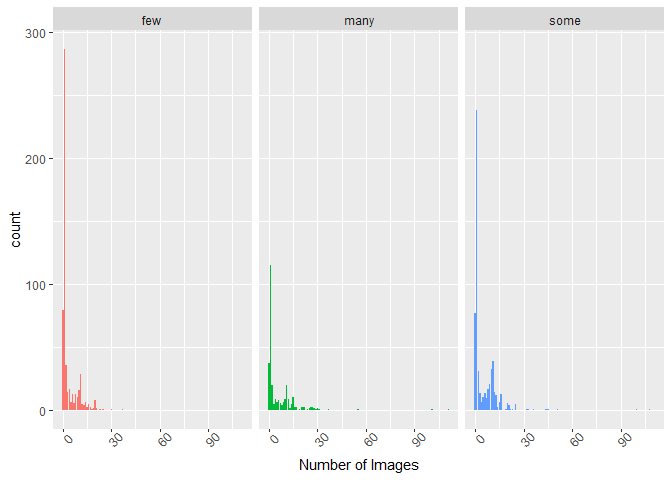
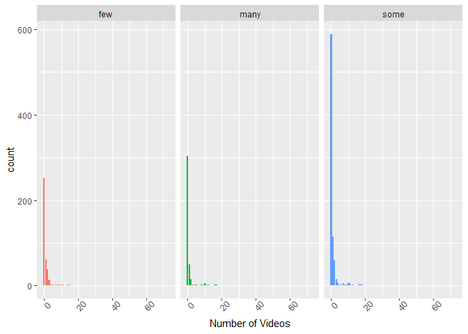

Social Media
================
Brennan Clinch
10/22/2021

-   [Introduction](#introduction)
-   [Import and Subset data](#import-and-subset-data)
-   [Split data into training and test
    set](#split-data-into-training-and-test-set)
-   [EDA](#eda)

# Introduction

We are going to analyze the Online News Popularity dataset. It is a
dataset which is used to predict the number of shares and article
published on Mashable.com got on social media sites.We are going to use
the following variables to predict Number of Shares. We are going to
analyze the Online News Popularity dataset. It is a dataset which is
used to predict the number of shares and article published on
Mashable.com got on social media sites.We are going to use the following
variables to predict Number of Shares. *num\_imgs: Number of images  
*num\_videos: Number of videos  
*average\_token\_length: Average length of the words in the content
and  
*title\_sentiment\_polarity: Title polarity

To predict the Number of Shares, we will use linear regression and
ensemble based tree methods, including random forest and boosted trees.

The data channel we are using here is social media

# Import and Subset data

I am going to import the dataset using a relative path and then subset
it to only include data from the social media channel.

``` r
library(readr)
library(dplyr)
data0<-read_csv("OnlineNewsPopularity.csv")
```

    ## Rows: 39644 Columns: 61

    ## -- Column specification --------------------------------------------
    ## Delimiter: ","
    ## chr  (1): url
    ## dbl (60): timedelta, n_tokens_title, n_tokens_content, n_unique_...

    ## 
    ## i Use `spec()` to retrieve the full column specification for this data.
    ## i Specify the column types or set `show_col_types = FALSE` to quiet this message.

``` r
data0<-subset(data0, data_channel_is_socmed == 1)
head(data)
```

# Split data into training and test set

``` r
library(caret)
set.seed(8758)
trainIndex <- createDataPartition(data0$shares, 
                                  p = 0.7, list = FALSE)
data<- data0[trainIndex, ]
datatest <- data0[-trainIndex, ]
```

# EDA

It is of interest to know what some information about the number of
images and the number of videos are on the most shared media. To do
this, first I will examine the 5 number summary for shares to develop an
understanding of what “a lot” of shares is vs. “few”.

``` r
sharesSumm<-data %>% 
  summarize("Min"=min(shares),
            "1st Quartile"=quantile(shares,0.25),
            "Median"=quantile(shares,0.5),
            "3rd Quartile"=quantile(shares,0.75),
            "Max"=max(shares)
            )
knitr ::kable(sharesSumm)
```

| Min | 1st Quartile | Median | 3rd Quartile |    Max |
|----:|-------------:|-------:|-------------:|-------:|
|   5 |         1400 |   2100 |         3800 | 122800 |

Based on this information, I will categorize the numbers of shares in
the following way: *Less that 1400 shares is “few” *Between 1400 and
3800 shares is “some” \*More than 3800 is “many” I will add a
categorical variable to the data to reflect this categorization and use
it to visualize the number of images and then videos in media.

``` r
library(ggplot2)
data<- data %>% 
  mutate(sharecategory = ifelse(shares <1400, "few",
                      ifelse(shares <=3800, "some",
                             "many")))
g<-ggplot(data=data,aes(x=num_imgs,fill=sharecategory))
g+geom_bar(position="dodge")+
  labs(x="Number of Images")+
  theme(legend.title=element_blank(),
        axis.text.x=element_text(angle=45))+
  facet_wrap(~sharecategory)+
  theme(legend.position = "None")
```

<!-- -->

``` r
g<-ggplot(data=data,aes(x=num_videos, fill=sharecategory))
g+geom_bar(position="dodge")+
  labs(x="Number of Videos")+
  theme(legend.title=element_blank(),
        axis.text.x=element_text(angle=45))+
  facet_wrap(~sharecategory)+
  theme(legend.position = "None")
```

<!-- -->

We can inspect the trend of number of images and videos and how it
affects number of shares. If the tallest and most concentrated chunk of
bars is in a different spot for each share category, then we can
conclude that the number of images videos (depending on the graph you
are looking at) is related to the number of shares. If each of the three
graphs looks the same, then we would conclude that images and videos do
not necessarily impact the number of shares.

I hypothesize that the shorter the average word length, the more popular
a media item will be. So we will analyze word length next. First, let’s
get the mean and standard deviation of word length in all of the media
items. Next, we can look at how word length differs based on share
category.
