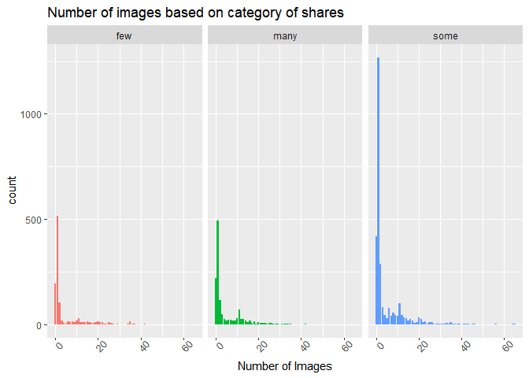
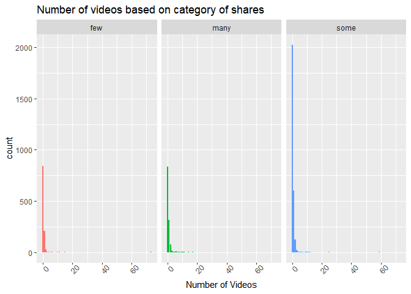
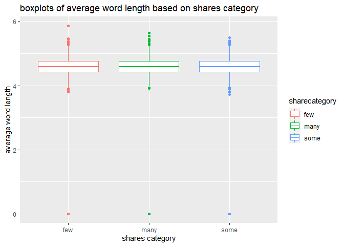
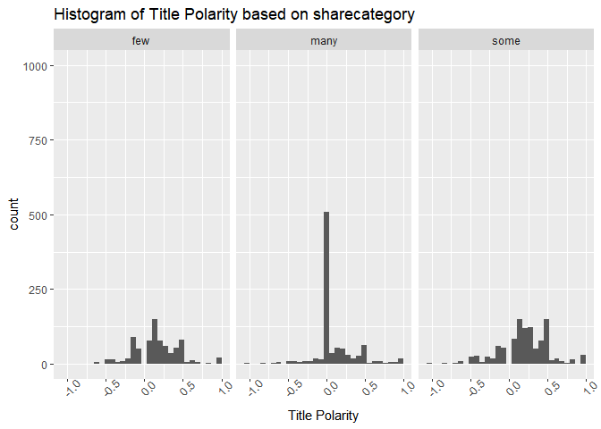

Technology Analysis
================
Brennan Clinch
10/29/2021


# Introduction

We are going to analyze the Online News Popularity dataset. It is a
dataset which is used to predict the number of shares and article
published on Mashable.com got on social media sites.We are going to use
the following variables to predict Number of Shares. We are going to
analyze the Online News Popularity dataset. It is a dataset which is
used to predict the number of shares and article published on
Mashable.com got on social media sites.We are going to use the following
variables to predict Number of Shares.

\*num\_imgs: Number of images

\*num\_videos: Number of videos

\*average\_token\_length: Average length of the words in the content

and

\*title\_sentiment\_polarity: Title polarity

To predict the Number of Shares, we will use linear regression and
ensemble based tree methods, including random forest and boosted trees.

# Import and Subset data

``` r
library(tidyverse)
library(caret)
## Read in Raw Data Using Relative Path
Data <- read_csv("OnlineNewsPopularity.csv") 
```

``` r
library(caret)
## Create a New Variable to Data Channel to use when automating.
automationdata <- Data %>% mutate(data_channel =   if_else(data_channel_is_lifestyle == 1, "Lifestyle Analysis",
       if_else(data_channel_is_entertainment == 1, "Entertainment Analysis",
               if_else(data_channel_is_bus == 1, "Business Analysis",
                      if_else(data_channel_is_socmed == 1, "Social Media Analysis",
                              if_else(data_channel_is_tech == 1, "Tech Analysis", "World Analysis"))))))
## Subset Data for Respective Data Channel
subsetted_data <- automationdata %>% filter(data_channel == params$data_channel)
## Create Training and Test Data Sets
set.seed(500)
trainIndex <- createDataPartition(subsetted_data$shares, p = 0.7, list = FALSE)
trainData <- subsetted_data[trainIndex,]
testData <- subsetted_data[-trainIndex,]
trainData
```

## Exploratory Data Analysis (EDA)

``` r
sharesSumm<-trainData %>% 
  summarize("Min"=min(shares),
            "1st Quartile"=quantile(shares,0.25),
            "Median"=quantile(shares,0.5),
            "3rd Quartile"=quantile(shares,0.75),
            "Max"=max(shares)
            )
knitr ::kable(sharesSumm, caption = "5-number summary for number of shares")
```

| Min | 1st Quartile | Median | 3rd Quartile |    Max |
|----:|-------------:|-------:|-------------:|-------:|
|  36 |         1100 |   1700 |         3000 | 663600 |

5-number summary for number of shares

Let’s start by creating a new factor variable for the training set which
categorizes shares based on the number of them.

After creating the new variable, let’s create a contingency table for
it.

``` r
library(ggplot2)
trainData<- trainData %>% 
  mutate(sharecategory = ifelse(shares <1400, "few",
                      ifelse(shares %in% 1400:3800, "some",
                             "many")))
testData <- testData %>% mutate(sharecategory = ifelse(shares <1400, "few",ifelse(shares %in% 1400:3800, "some",
                             "many")))
knitr::kable(table(trainData$sharecategory), caption = paste0("contingency table for sharecategory"))
```

| Var1 | Freq |
|:-----|-----:|
| few  | 1837 |
| many |  929 |
| some | 2379 |

contingency table for sharecategory

Let’s now create bar plots of the number of images based on the new
variable which is the category of shares based on the number of them.

``` r
g<-ggplot(data=trainData,aes(x=num_imgs,fill=sharecategory))
g+geom_bar(position="dodge")+
  labs(x="Number of Images", title = "Number of images based on category of shares")+
  theme(legend.title=element_blank(),
        axis.text.x=element_text(angle=45))+
  facet_wrap(~sharecategory)+
  theme(legend.position = "None")
```

<!-- -->

``` r
g<-ggplot(data=trainData,aes(x=num_videos, fill=sharecategory))
g+geom_bar(position="dodge")+
  labs(x="Number of Videos", title = "Number of videos based on category of shares")+
  theme(legend.title=element_blank(),
        axis.text.x=element_text(angle=45))+
  facet_wrap(~sharecategory)+
  theme(legend.position = "None")
```

<!-- -->

We can inspect the trend of number of images and videos and how it
affects number of shares. If the tallest and most concentrated chunk of
bars is in a different spot for each share category, then we can
conclude that the number of images videos (depending on the graph you
are looking at) is related to the number of shares. If each of the three
graphs looks the same, then we would conclude that images and videos do
not necessarily impact the number of shares.

I hypothesize that the shorter the average word length, the more popular
a media item will be. So we will analyze word length next. First, let’s
get the mean and standard deviation of word length in all of the media
items. Next, we can look at how word length differs based on share
category.

``` r
wordSumm<-trainData %>% 
  summarize("Mean"=mean(average_token_length),
            "Standard Deviation"=sd(average_token_length))
knitr ::kable(wordSumm, caption = "Mean and Standard deviation of average word length")
```

|     Mean | Standard Deviation |
|---------:|-------------------:|
| 4.582233 |          0.3586704 |

Mean and Standard deviation of average word length

``` r
wordSumm2<-trainData %>% group_by(sharecategory) %>%
  summarize("Mean"=mean(average_token_length),
            "Standard Deviation"=sd(average_token_length))
knitr ::kable(wordSumm2, caption = "Mean and Standard deviation of average word length by share category")
```

| sharecategory |     Mean | Standard Deviation |
|:--------------|---------:|-------------------:|
| few           | 4.588598 |          0.2999857 |
| many          | 4.564346 |          0.4664693 |
| some          | 4.584304 |          0.3517432 |

Mean and Standard deviation of average word length by share category

This can better be summarized with the boxplots below

``` r
g1 <- ggplot(data = trainData, aes(x=sharecategory, y = average_token_length, color = sharecategory))
g1+geom_boxplot()+
  labs(title = "boxplots of average word length based on shares category", x = "shares category", y = "average word length")
```

<!-- -->

Finally, we’ll explore the title polarity vs. the share category.

``` r
g<-ggplot(data=trainData,aes(title_sentiment_polarity,color=title_sentiment_polarity))
g+geom_histogram(aes(fill=title_sentiment_polarity),position="dodge")+labs(x="Title Polarity", title = "Histogram of Title Polarity based on sharecategory")+theme(legend.title=element_blank(), axis.text.x=element_text(angle=45))+scale_y_continuous(limits= c(0,1000))+facet_wrap(~sharecategory)
```

    ## `stat_bin()` using `bins = 30`. Pick better value with
    ## `binwidth`.

    ## Warning: Removed 2 rows containing missing values (geom_bar).

<!-- -->

# Model fitting

## Linear Models

The main idea of linear regression models is that we look at a dependent
variable (our response variable) as a function of a set of independent
variables of our choosing (our predictor variables) which ends up being
linear. The two types are OLS which stands for ordinary least squares
along with GLM which is abbreviated as generalized linear model. OLS is
used when we are looking at errors that follow a normal distribution.
GLM is used when we are looking at errors that do not follow a normal
distribution.

### Model 1: (OLS)

The first model we will be fitting is a linear model (OLS) with shares
as the response and has all interaction model options from our
predictors (number of videos, average word length, and title polarity).

``` r
train1<-train(shares~num_imgs
                  *num_videos
                  *average_token_length
                  *title_sentiment_polarity,
              data=trainData,
              method="lm",
              preProcess=c("center","scale"),
              trControl=trainControl(method="cv",number=10))
```

### Model 2: Poisson Regression model (GLM)

The second model we will be creating is a poisson regression model which
is a generalized linear model. In this model, poisson is applied to all
the previous variables for all the interaction terms. We can use poisson
here since these come from all news articles coming from a 2 year period
which is a fixed amount of time.

Our model for the tech channel is (lambda(shares)\~num\_imgs
*num\_videos*average\_token\_length\*title\_sentiment\_polarity)

We will call this model our **Poisson Model**

``` r
train2 <- train(shares~num_imgs
                  *num_videos
                  *average_token_length
                  *title_sentiment_polarity,
              data=trainData,
              method="glm",
              family = "poisson",
              preProcess=c("center","scale"),
              trControl=trainControl(method="cv",number=10))
```

# Ensemble Methods

Tree-based ensemble methods are very important in that they allow us to
look at multiple areas of a non-linear model at once and map them out to
be able for us to easily interpret our predictive models. The two ones
that we will be using here and the ones that are the most popular are
boosted trees and random forests. We will be doing a grid search in our
repeated k-fold cross validations to tune our models for the best
hyper-parameters

## Boosted Tree Model

Boosting is a process where models are trained sequentially. The focus
is put on situations where the model fails to predict correctly a
statistically significant amount of the time. These models are given
more weight so that they are more likely to appear in any given sample.
Therefore, the tree will focus on getting these correct and therefore
improve the overall prediction. As this process continues, the model
gets stronger and stronger.Boosting is particularly robust against
overfitting.

Here I will do boosting with 5 fold repeated cross validation (3 times).
I will then print the confusion matrix on the test set.

``` r
ctrl <- trainControl(method="repeatedcv",number=5, repeats = 3)
boostFit <- train(shares~num_imgs
                  *num_videos
                  *average_token_length
                  *title_sentiment_polarity
                  ,data = trainData, 
                method = "gbm", trControl = ctrl, metric = "RMSE",
                preProcess = c("center","scale"), verbose = FALSE, 
                tuneGrid =  expand.grid(n.trees = 25, 
                              shrinkage = 0.1,
                              interaction.depth = c(1:4),
                              n.minobsinnode = 10))
```

## Random Forest

The idea of Random Forests is that they generate `B` bootstrapped
samples and fit trees to each of the samples. They use a random subset
of predictors for each bootstrap sample/tree fit. Then the trees grow
independently of one another while also being averaged. Averaging the
trees along with letting the trees grow independently can lower our
variance we are using for prediction.

``` r
fitrf <- train(shares~num_imgs*num_videos*average_token_length*title_sentiment_polarity,method = "rf",data = trainData,
             trControl = ctrl, 
             metric = "RMSE",
             tuneGrid = data.frame(mtry = 1:3))
```

# Model Comparison

With the repeated k-folds CV completed and our models fit, we can
evaluate their performance in CV and on the withheld testing set.

Let’s evaluate their repeated k-folds CV performance first

So we first set up a list and vectors of our models to store in a
table/data frame for later when looking at our top candidate

``` r
model_Name <- c("OLS", "Poisson Regression", "Random Forest", "Boosted tree")

train1$results
train2$results
fitrf$results
boostFit$results
```

``` r
pred1 <- predict(train1, newdata = testData)
OLS <- postResample(pred1, obs = testData$shares)
pred2 <- predict(train2,newdata = testData)
Poisson <- postResample(pred2,testData$shares)
pred3 <- predict(fitrf, newdata = testData)
Random_Forest <- postResample(pred3, testData$shares)
pred4 <- predict(boostFit, newdata = testData)
Boosted_Tree <- postResample(pred4,testData$shares)

resultsdf <- data.frame(OLS,Poisson,Random_Forest,Boosted_Tree)
resultsdf
colnames(resultsdf)= model_Name
results <- as.data.frame(t(resultsdf))
FinalModel <- results %>% mutate(Model= model_Name) %>% filter(RMSE ==min(RMSE))%>% select(Model,RMSE)


BestModel <- FinalModel$Model
BestModelRMSE <- FinalModel$RMSE
knitr::kable(
  results,
  digits=3,
  caption="Testing Set Performance Summary",)
```

|                    |     RMSE | Rsquared |      MAE |
|:-------------------|---------:|---------:|---------:|
| OLS                | 4254.978 |    0.004 | 2282.265 |
| Poisson Regression | 4263.756 |    0.002 | 2280.226 |
| Random Forest      | 4765.788 |    0.000 | 2360.382 |
| Boosted tree       | 4278.184 |    0.003 | 2265.890 |

Testing Set Performance Summary

The best performing model on the testing set is the OLS with an RMSE of
4254.9776048.

